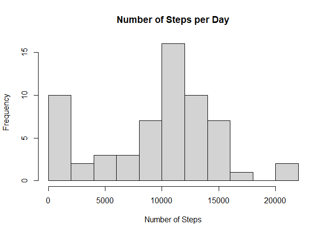
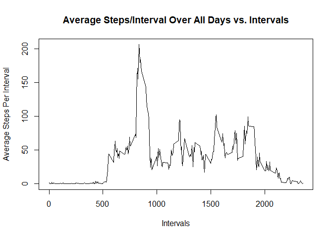
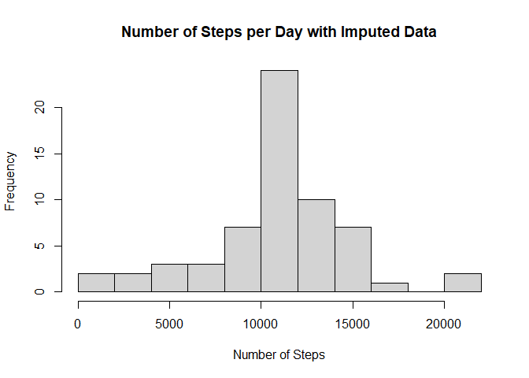
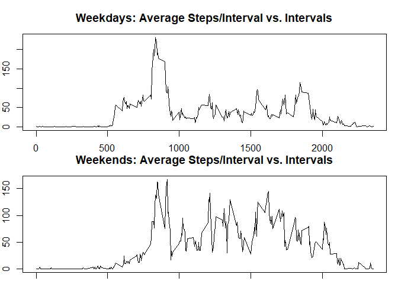

## Loading and preprocessing the data

```r
data <- read.csv(unzip("activity.zip"))
```

## What is mean total number of steps taken per day?

```r
#use tapply to calculate the total steps for each date
dailysteps<-tapply(data$steps, data$date, sum, na.rm=TRUE)

#mean and median number of steps per day
meansteps <- mean(dailysteps, na.rm=TRUE)
mediansteps <- median(dailysteps, na.rm=TRUE)

#draw histogram with 10 buckets
hist(dailysteps, 
     breaks = 10,
     main = "Number of Steps per Day", 
     xlab = "Number of Steps")
```

<!-- -->
  
The mean number of steps in a day is 9354.2295082.  
The median number of steps in a day is 10395.  

## What is the average daily activity pattern?

```r
#Calculate and store the mean #of steps for each 5-minute interval
meanstepsbyinterval <- tapply(data$steps, data$interval, mean, na.rm=TRUE)

#Time series plot of the 5-minute interval (x-axis) and the average number of 
#steps taken, averaged across all days (y-axis)
plot(x = as.numeric(names(meanstepsbyinterval)), 
     y = meanstepsbyinterval,
     type = "l",
     main = "Average Steps/Interval Over All Days vs. Intervals",
     xlab = "Intervals",
     ylab = "Average Steps Per Interval")  
```

<!-- -->

```r
#The 5-minute interval, on average across all the days in the dataset, 
#that contains the maximum number of steps:
maxstepsinterval <- which(meanstepsbyinterval == max(meanstepsbyinterval))
maxstepsintervalnum <- names(maxstepsinterval)
```

The 5-minute interval, on average across all the days in the dataset, that
contains the maximum number of steps begins at 835 minutes
with a maximum average of 206.1698113 steps.


## Imputing missing values

```r
#determine the number of rows that contain an na
narows <- sum(!complete.cases(data))

#if the number of steps for an interval is na, replace it with the mean number
#steps from the same inverval of other days. Put this in 'imputed'
imputed <- data
for(i in 1:length(data$steps)){
      if(is.na(data[i,1])) 
            imputed[i,1] = meanstepsbyinterval[as.character(data[i,3])]
}

#use tapply to calculate the total steps for each imputed date
imputeddailysteps<-tapply(imputed$steps, imputed$date, sum, na.rm=TRUE)

#mean and median number of steps per day
imputedmeansteps <- mean(imputeddailysteps, na.rm=TRUE)
imputedmediansteps <- median(imputeddailysteps, na.rm=TRUE)

#draw histogram with 10 buckets to compare with previous histogram
hist(imputeddailysteps,
     breaks = 10,
     main = "Number of Steps per Day with Imputed Data", 
     xlab = "Number of Steps")  
```

<!-- -->
  
After imputing, the new mean number of steps in a day is 1.0766189\times 10^{4}.  
The new median number of steps in a day is 1.0766189\times 10^{4}. 

## Are there differences in activity patterns between weekdays and weekends?

```r
#isWeekend is a boolean vector that indicates TRUE for a weekend day
isWeekend <- weekdays(as.Date(imputed$date)) %in% c("Saturday", "Sunday")

#Append factor variable to 'imputed' and use loop and isWeekend vector to 
#indicate the appropriate level
imputed$dayType = "Weekday"
for(i in 1:length(imputed$date)){
    if(isWeekend[i]) imputed[i,4] = "Weekend" 
}

#Split the imputed data and create the means steps per interval for each split
imputed<-split(imputed, imputed$dayType)
meanstepsbyintervalday <- tapply(imputed$Weekday$steps, 
                                 imputed$Weekday$interval,
                                 mean)
meanstepsbyintervalend <- tapply(imputed$Weekend$steps, 
                                 imputed$Weekend$interval,
                                 mean)

#set plotting parameters to show two plots with minimal margins
par(mfrow=c(2,1), mar = c(1, 2, 3, 1))
#Time series plot of the intervals and mean # of steps taken for...

#Weekdays, and...
plot(x = as.numeric(names(meanstepsbyintervalday)), 
     y = meanstepsbyintervalday,
     type = "l",
     main = "Weekdays: Average Steps/Interval vs. Intervals",
     xlab = "Intervals",
     ylab = "Average Steps Per Interval")
#Weekends:
plot(x = as.numeric(names(meanstepsbyintervalend)), 
     y = meanstepsbyintervalend,
     type = "l",
     main = "Weekends: Average Steps/Interval vs. Intervals",
     xlab = "Intervals",
     ylab = "Average Steps Per Interval")
```

<!-- -->
